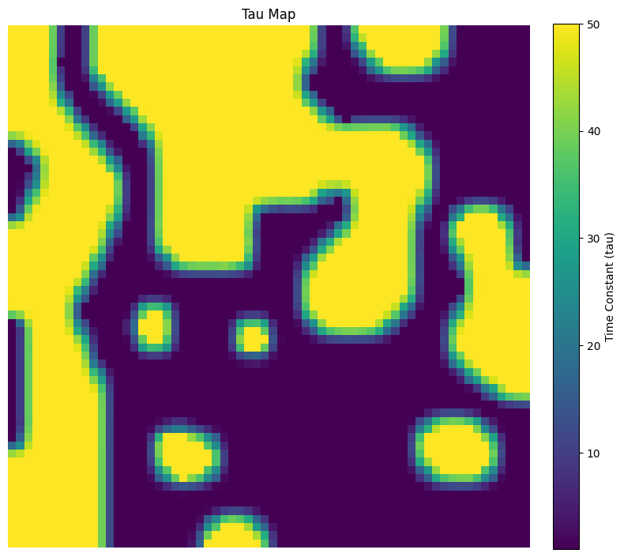
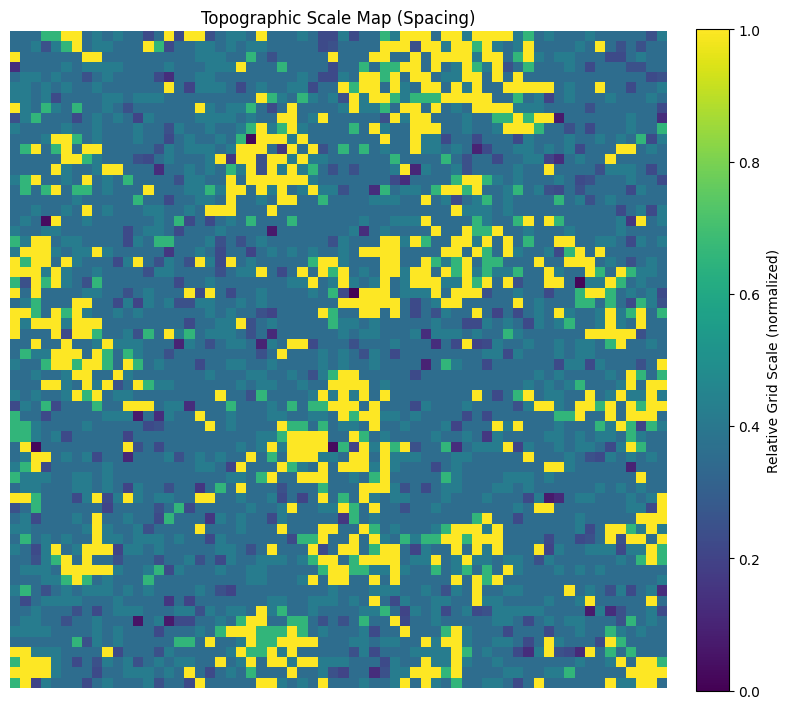

# Topographic Grid Cells

RNN path integrator that develops grid cell representations with topographic organization via a tau parameter and [topoloss-like](https://github.com/NavneetPra/topoloss) implementation. 

## Description

The project uses an RNN with 4096 hidden units (neurons) to predict the activity of 512 place cells with input vectors of the movement of the entity. After training, we are able to plot the activity of each of the hidden units. Some of the hidden units have a grid-cell-like pattern of activation within the 2.2 by 2.2 meter area for movement that the experiment is conducted in, which follows previous findings.

This project aims to make these grid cells topographically accurate. In the medial entorhinal cortex (MEC), grid cells are not topographic based on where exactly they fire (phase) but instead they are primarily topographic based on the spacing of grid cell firing fields (scale). Another part of grid cells that have not been replicated through computational models is that grid cells have different integration speeds which are linked to their scales. We use a modified RNN with a tau parameter that acts as the integration speed of each individual neuron and is learnable. With this, we use a topographic loss to make the model learn that neurons next to each other must have similar tau values. With this, we prove that tau values directly cause the difference in scale between grid cells and we are able to create a topographic RNN with grid cell emergence for path integration. 

## Results

Results can be viewed between the best topographic model and the base nontopographic model on [Weights & Biases](https://api.wandb.ai/links/topogrid/7h1d0f2v).

The mapping of the tau and the scale for each neuron in the best tau model is available here: 



Again, this demonstrates that the integration speeds of these neurons is what determines topography and is what creates the different scales in grid cells.

## Inspired By
- [DeepMind Grid Cells](https://github.com/google-deepmind/grid-cells)
- [Ganguli Lab Grid Pattern Formation](https://github.com/ganguli-lab/grid-pattern-formation)
- [Murty Lab Topoloss](https://github.com/murtylab/topoloss)

## Setup

```bash
conda env create -f environment.yml
conda activate topogrid
```

## Training

```bash
# Train without topographic loss and tau
python train_grid.py --steps 100000

# Train with tau topographic loss
python train_grid.py --tau --steps 100000
```
